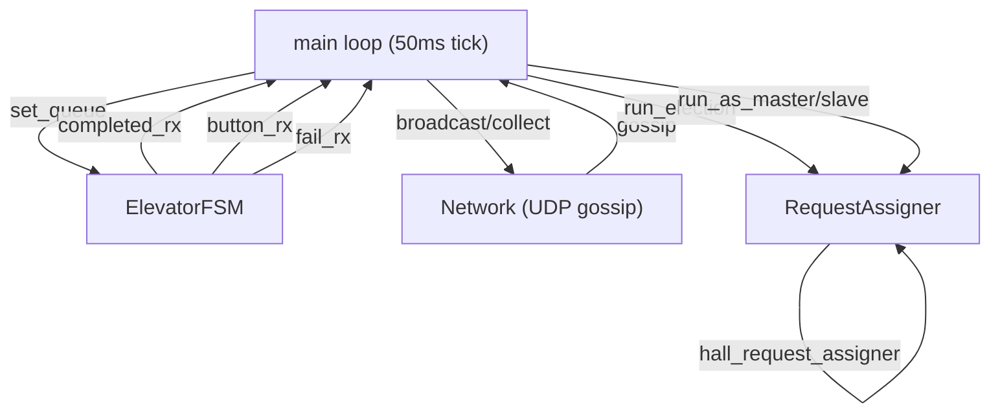
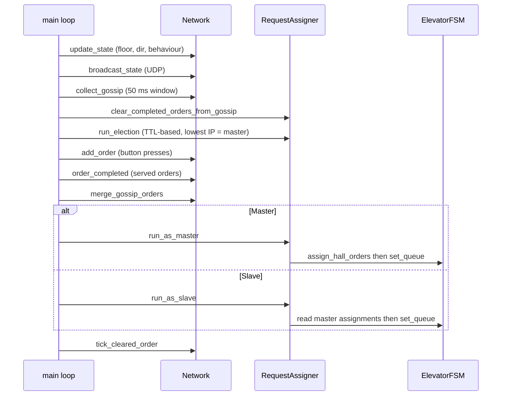
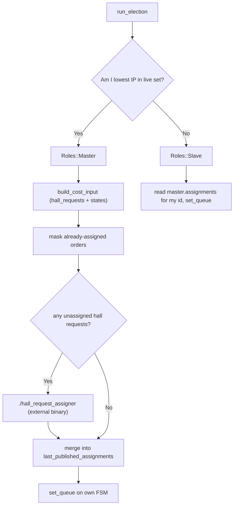

# ttk4145_elevatorlab

Project in Sanntidssystemer (Real-Time Systems) by August Lind, Espen Johnsen Bentdal and Oliver Wahlen.

Distributed elevator control system written in Rust, supporting 1–3 elevators across 4 floors.

---

## Quick Start

```bash
# Terminal 1 – start the elevator simulator
~SimElevatorServer --port 15657

# Terminal 2 – run the controller (default port 15657)
cd main_project && cargo run

# Multiple elevators – pass port as first argument
~/Downloads/SimElevatorServer --port 15658
cd main_project && cargo run -- 15658
```

If the simulator fails with `Unable to bind socket: Address already in use`:
```bash
sudo lsof -iTCP:15657 -sTCP:LISTEN   # find the PID
sudo kill $PID
```

---

## Architecture

The system is built around three concurrent components running inside a single Tokio async runtime:



### Modules

| File | Responsibility |
|------|---------------|
| `main.rs` | Event loop: collects gossip, runs election, dispatches role logic, handles restart |
| `fsm.rs` | `ElevatorGuard` — hardware driver wrapper; two tasks (order runner, button poller) |
| `networkhandler.rs` | `Network` — UDP broadcast send/receive; gossip state management |
| `requests.rs` | `RequestAssigner` — master election, cost-function call, order assignment |
| `types.rs` | All shared types (`Order`, `GossipMsg`, `Behaviour`, `Direction`, …) |
| `config.rs` | Compile-time constants (floors, ports, timeouts) |

---

## Main Loop

Every ~50 ms tick the main loop does the following:



---

## Elevator FSM

`ElevatorGuard` wraps the hardware driver behind two `tokio::sync::Mutex` guards (state + queue) and spawns two background tasks.

| State | Entry condition | Exit condition |
|-------|----------------|----------------|
| `Init` | Power on | Drives down until floor sensor triggers |
| `Idle` | Known floor reached / order served | Order added to queue |
| `Moving` | Order queued, target selected | Target floor reached |
| `DoorOpen` | Target floor reached | 3s elapsed with no obstruction |
| *(restart)* | Order timeout (9s) or obstruction timeout (3s) | `emergency_stop` + `restart_self` |

**Order selection (`next_target`):** SCAN-like — prefers the nearest floor ahead in the current direction; falls back to the nearest floor in any direction when the queue is exhausted in the current sweep.

---

## Network & Gossip

All nodes broadcast a `GossipMsg` over UDP every loop tick. Each message carries:

- Node identity (`id` = local IP)
- Current elevator state (floor, direction, behaviour)
- Known hall orders and cab orders
- Peer cab orders (for crash recovery)
- Current role (Master / Slave)
- Master's hall-order assignments
- Last cleared order

Every node broadcasts its full `GossipMsg` to all peers on every tick. Communication is fully peer-to-peer — there is no central broker.

```
Elevator 1 (master)  <--->  Elevator 2 (slave)
        ^                          ^
        |                          |
        +------->  Elevator 3 (slave)  <---+
```

Hall orders are merged from all peers and persist locally until a `cleared_order` signal propagates. This means hall orders survive node restarts as long as one peer is alive.

---

## Master Election & Order Assignment

Election uses **lowest-IP wins**: each node tracks `last_seen` timestamps for all peers. Any peer not seen within 2 s is evicted. The node with the lexicographically smallest IP in the live set is master.



When a slave disappears (evicted from `last_seen`), its entry is removed from `last_published_assignments` so the cost function sees those hall requests again and reassigns them to a live elevator.

---

## Fault Tolerance

| Failure | Behaviour |
|---------|-----------|
| Node crash / network loss | Peers evict after 2 s; master reassigns hall orders |
| Obstruction (door stuck) | Wait up to 3 s, then emergency stop + `restart_self()` |
| Order timeout (9 s) | Emergency stop + `restart_self()` |
| Power loss (cab orders) | Recovered from peers' `peer_cab_orders` on restart |
| New peer joins | `new_peer_joined` flag forces full reassignment |

---

## Configuration (`config.rs`)

| Constant | Value | Description |
|----------|-------|-------------|
| `NUM_FLOORS` | 4 | Number of floors |
| `ELEVATOR_PORT` | 15657 | Default simulator TCP port |
| `MSG_PORT` | 20009 | UDP gossip port |
| `MASTER_ELECTION_TIMEOUT` | 2 000 ms | Peer eviction TTL |
| `ORDER_TIMEOUT` | 9 s | Max time to complete an order before restart |
| `OBSTRUCTION_TIMEOUT` | 3 s | Max time door is held open by obstruction |
| `DOOR_OPEN_DURATION` | 3 s | Normal door-open time |
